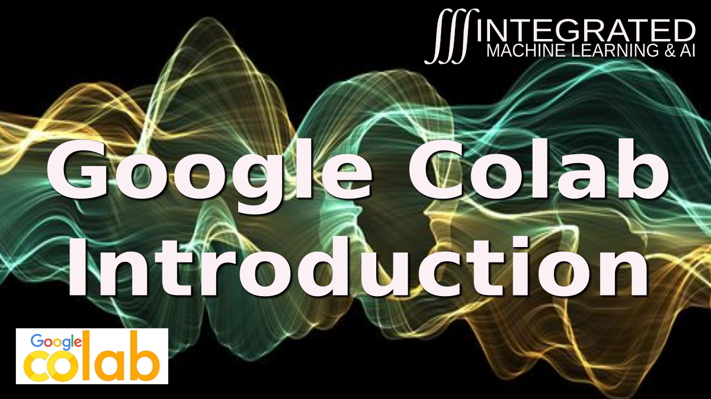

# Google Colab Instructions for Machine Learning Pipeline Class
The link to code that Thom and Ghaith will create for you can be found [HERE](http://bit.ly/2NQwH63)

The link to Thom's introductory video for basic Google Colab operations is here 