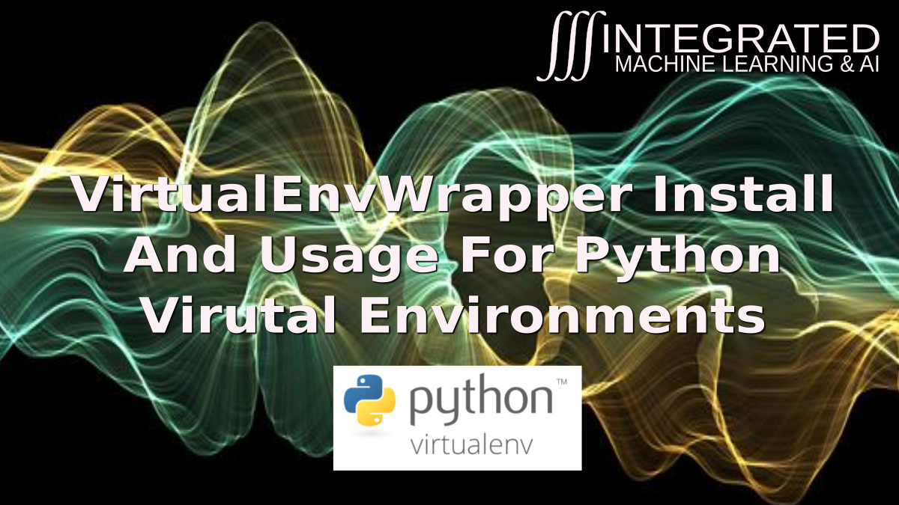
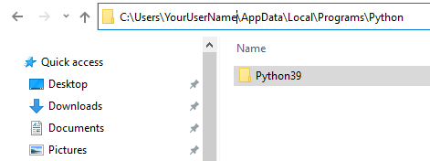
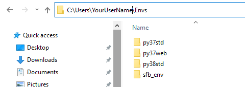
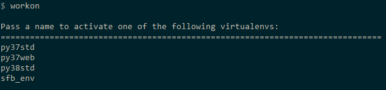
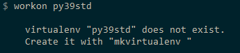
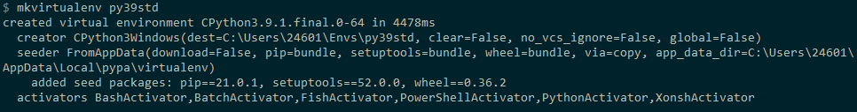
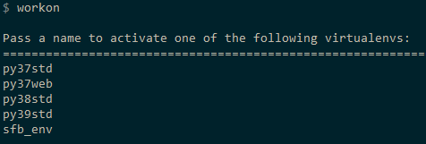
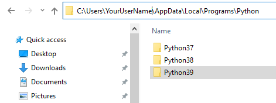

# Managing Virtual Environments in Windows

## Prerequisites
IF you have not yet installed python, go to python.org and install the latest stable python version for your OS.

The link to Thom's instructional video for setting up and installing Python virtual environment wrapper for Windows  [](https://youtu.be/JJTWJmoo-Gs "Python Virtual Environments with VirtualEnvWrapper for Windows")

_______________
## If You ONLY Have ONE Python Version Installed On Windows
1. You will find all your installed python versions in C:\Users\YourUserName\AppData\Local\Programs\Python
2. The way python versions appear on Thom's windows machine are show below ...



3. If you only see a single Python version installed, follow instructions in this section. If you see more, I suggest going to the next section titled **If You Have Multiple Python Versions Installed On Windows**
4. When you install Python, the installation will ask you if you want to add the python executables to your path statement. If for some reason you did not do this, it's best to add `C:\Users\YourUserName\AppData\Local\Programs\Python\Python3x`
to your path statement. You will also want to add
C:\Users\YourUserName\AppData\Local\Programs\Python\Python3x\Scripts
to your path statement. This will make everything below go much smoother. 
5. pip can be defined multiple ways. My favorite definition is 
"preferred installer program".
6. `pip` is stored in 
`C:\Users\YourUserName\AppData\Local\Programs\Python\Python3x\Scripts`
7. If you look in that directory, you will find `pip3.exe` and `pip3.9.exe`
7. In each python x version scripts directory, you will find `pip3.x.exe`
8. From a terminal window (I recommend installing ConEmu for a great terminal program - it's the best that I have found so far), run 
`pip install virtualenvwrapper-win`
9. Once the pip install is done, you will see some new files in `C:\Users\YourUserName\AppData\Local\Programs\Python\Python39\Scripts`
    * rmvirtualenv.bat
    * virtualenv.exe
    * virtualenvwrapper.bat
    * vwenv.bat
    * whereis.bat
    * workon.bat

### Default Location Of Virtual Environments
1. If you have existing python virtual environments, they are likely here C:\Users\YourUserName\Envs
2. The image below shows the ones on my windows machine



### Activating Existing Virtual Environments
1. Let's open a command terminal and run ```$ workon```
2. Notice below that it lists virtual environments in our holding directory



3. What happens if we try to workon a virtual environment that does not yet exist?



4. To create a new virtual environment using our new python39 install,



5. Let's just run ```$ workon``` to see if it shows up in our list



6. Now to actually workon that environment, we run ```$ workon py39std``` 
7. That python environment will be activated and will show up with our command prompt.
8. To stop using an environment, run ```$ deactivate```

### How To Install Virtual Environment Wrapper When You Have "ONE" Version Of Python On Your Machine

## If You Have "Multiple" Python Versions Installed On Windows
1. You will find all your installed python versions in C:\Users\YourUserName\AppData\Local\Programs\Python
2. The way python versions appear on Thom's windows machine are show below ...



3. When you have multiple versions, your path can point to multiple Python directories, and you want to make sure that your system is using the pip for the version of Python that you are wanting to work with.
_____________
### How To Install Virtual Environment Wrapper For A Specific Version Of Python WHEN You Have "MULTIPLE" Python Versions

When you have multiple Python versions, your path can point to multiple Python directories, and you want to make sure that your system is using the version of Python pip that you NEED to use.

1. Each Python installation has it's own version of pip as explained previously.
2. They are stored in `C:\Users\YourUserName\AppData\Local\Programs\Python\Python3x\Scripts`
3. In each python x version scripts directory, you will find `pip3.x.exe`
4. From a terminal window (Again, I recommend installing ConEmu), AND TO BE EXTRA CAREFUL, run 
`C:\Users\YourUserName\AppData\Local\Programs\Python\Python3x\Scripts\pip3.x install virtualenvwrapper-win`
5. Once the pip install is done, you will see some new files in C:\Users\YourUserName\AppData\Local\Programs\Python\Python39\Scripts
    * rmvirtualenv.bat
    * virtualenv.exe
    * virtualenvwrapper.bat
    * vwenv.bat
    * whereis.bat
    * workon.bat

### Default Location Of Virtual Environments
1. Just like the above instructions, if you have existing python virtual environments, they are likely here 
`C:\Users\YourUserName\Envs`
2. The image below shows the ones on my windows machine


### Activating Existing Virtual Environments
1. Let's open a command terminal and run ```$ workon```
2. Notice below that it lists virtual environments in our holding directory


3. What happens if we try to workon a virtual environment that does not yet exist?


4. To create a new virtual environment using our new python39 install,


5. Let's just run ```$ workon``` to see if it shows up in our list


6. Now to actually workon that environment, we run ```$ workon py39std``` 
7. That python environment will be activated and will show up with our command prompt.
8. To stop using an environment, run ```$ deactivate```
_________
### Virtual Environments In Your IDE (VS CODE)
In VS Code OR your chosen IDE, there will be a package that will allow you to switch between virtual environments AND to likely create virtual environments from within your IDE. Once you pick the package you prefer for this, read the documentation to know how to use those packages that help you choose your virtual environment. Those explanations are usually pretty clear, and you can web search for help if you need help. Many will have had the same issues as you.
