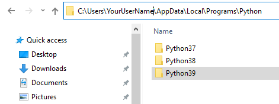
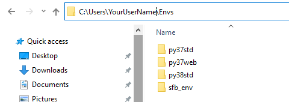
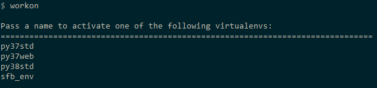
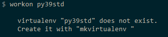
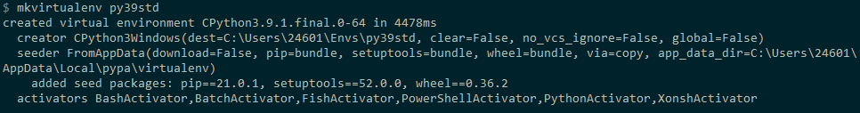
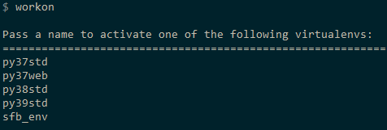

# Managing Virtual Environments in Windows

## Prerequisites
IF you have not yet installed python, go to python.org and install the latest stable python version of your OS.

## Multiple Python Versions On Windows
1. You will find all your installed python versions in C:\Users\YourUserName\AppData\Local\Programs\Python
2. The way python versions appear on Thom's windows machine are show below ...



## How To Install Virtual Environment Wrapper For A Specific Version Of Python
1. Each python install has it's own version of pip.
2. They are stored in C:\Users\YourUserName\AppData\Local\Programs\Python\Python3x\Scripts
3. In each python x version scripts directory, you will find pip3.x.exe
4. From a terminal window (I recommend installing ConEmu), run pip3.x install virtualenvwrapper-win
5. Once the pip install is done, you will see some new files in C:\Users\YourUserName\AppData\Local\Programs\Python\Python37\Scripts
    * rmvirtualenv.bat
    * virtualenv.exe
    * virtualenvwrapper.bat
    * vwenv.bat
    * whereis.bat
    * workon.bat

## Default Location Of Virtual Environments
1. If you have existing python virtual environments, they are likely here C:\Users\YourUserName\Envs
2. The image below shows the ones on my windows machine



## Activating Existing Virtual Environments
1. Let's open a command terminal and run ```$ workon```
2. Notice below that it lists virtual environments in our holding directory



3. What happens if we try to workon a virtual environment that does not yet exist?



4. To create a new virtual environment using our new python39 install,



5. Let's just run ```$ workon``` to see if it shows up in our list



6. Now to actually workon that environment, we run ```$ workon py39std``` 
7. That python environment will be activated and will show up with our command prompt.
8. To stop using an environment, run ```$ deactivate```

## Virtual Environments In Your IDE (VS CODE)
In VS Code OR your chosen IDE, there will be a package that will allow you to switch between virtual environments AND to likely create virtual environments from within your IDE. Once you pick the package you prefer for this, read the documentation to know how to use them. It's usually pretty clear, and you can web search for help if you need help. Many will have had the same issues as you.
